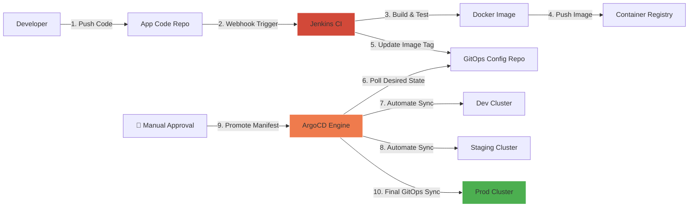
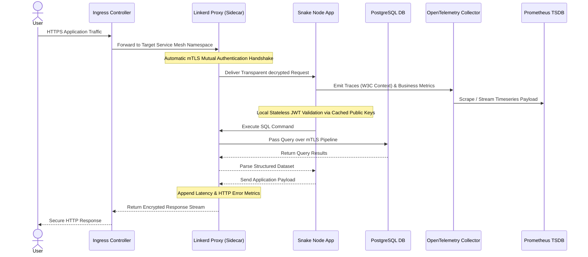
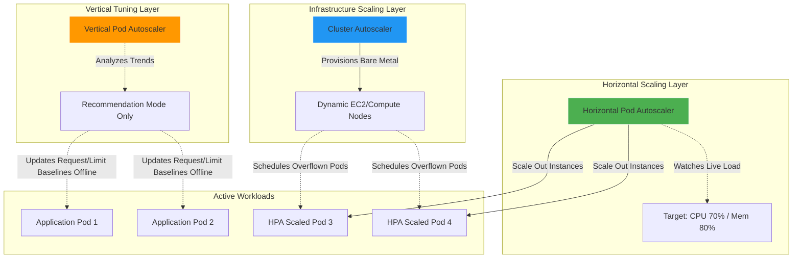

# Global Multi-Region DevSecOps Architecture & Application Stack

Welcome to the production-grade architecture blueprint for a secure, high-availability, globally distributed gaming platform ("Snake App"). This project demonstrates advanced cloud-native engineering principles, incorporating GitOps, DevSecOps, Service Mesh, Multi-Dimensional Scaling, and Multi-Region resilience using a 100% open-source stack.

---

## 🏛️ 1. Global Infrastructure Layer

To deliver sub-millisecond frontend rendering and minimal latency worldwide, the infrastructure is deployed across three geographic regions using latency-based routing and centralized state management.

```mermaid
graph TB
    subgraph "Global Edge Layer"
        DNS[Global DNS / Route53]
        CDN[Cloudflare CDN & WAF]
        GLB[Global Load Balancer]
    end

    subgraph "Region: US-EAST (Primary)"
        subgraph "us-east-1 Cluster"
            USE_APP[Snake App]
            USE_DB[PostgreSQL Primary]
            USE_PROM[Prometheus]
        end
    end

    subgraph "Region: EU-WEST (Replica)"
        subgraph "eu-west-1 Cluster"
            EUW_APP[Snake App]
            EUW_DB[PostgreSQL Replica]
            EUW_PROM[Prometheus]
        end
    end

    subgraph "Region: AP-SOUTH (Replica)"
        subgraph "ap-south-1 Cluster"
            APS_APP[Snake App]
            APS_DB[PostgreSQL Replica]
            APS_PROM[Prometheus]
        end
    end

    subgraph "Central Control Plane"
        ARGO[ArgoCD Hub]
        VAULT[HashiCorp Vault]
        GRAFANA[Grafana Global]
        THANOS[Thanos Query]
    end

    DNS --> CDN
    CDN --> GLB
    GLB -->|Latency-Based Routing| USE_APP
    GLB -->|Latency-Based Routing| EUW_APP
    GLB -->|Latency-Based Routing| APS_APP
    
    USE_DB -->|Streaming Replication| EUW_DB
    USE_DB -->|Streaming Replication| APS_DB

    ARGO -->|GitOps Pull Engine| USE_APP
    ARGO -->|GitOps Pull Engine| EUW_APP
    ARGO -->|GitOps Pull Engine| APS_APP

    USE_PROM --> THANOS
    EUW_PROM --> THANOS
    APS_PROM --> THANOS
    THANOS --> GRAFANA

    VAULT -.->|Secure Secret Injection| USE_APP
    VAULT -.->|Secure Secret Injection| EUW_APP
    VAULT -.->|Secure Secret Injection| APS_APP

    style USE_APP fill:#4CAF50,stroke:#fff
    style EUW_APP fill:#4CAF50,stroke:#fff
    style APS_APP fill:#4CAF50,stroke:#fff
    style ARGO fill:#EF7B4D,stroke:#fff
    style THANOS fill:#6D41FF,stroke:#fff
    style VAULT fill:#000000,stroke:#fff
```



* **Global Traffic Management:** Cloudflare handles edge scrubbing and DDoS mitigation. The Global Load Balancer dynamically targets the closest healthy cluster.
* **Data Persistence:** A single read/write instance in `us-east-1` coordinates streaming replication to read-replicas in `eu-west-1` and `ap-south-1`. Write queries from edge regions are proxied across the WAN backbone.
* **Federated Metrics:** Regional Prometheus metrics are federated globally via Thanos Query, enabling unified dashboarding in a centralized Grafana instance.

---

## 🚀 2. CI/CD & GitOps Continuous Delivery

Software release management is completely decoupled: Jenkins operates as the isolation gate for continuous integration, while ArgoCD manages the continuous deployment state via a pull-based GitOps pipeline.



### Declarative Jenkinsfile Pipeline
```groovy
pipeline {
    agent any
    environment {
        REGISTRY = "docker.io/architecture-portfolio/snake-app"
        IMAGE_TAG = "${env.BUILD_NUMBER}"
        GIT_CONFIG_REPO = "://github.com"
    }
    stages {
        stage('Static Analysis & Test') {
            steps {
                checkout scm
                sh 'npm ci && npm test'
                sh 'echo "Running SonarQube SAST analysis..."'
            }
        }
        stage('Secure Build') {
            steps {
                sh "docker build -t ${REGISTRY}:${IMAGE_TAG} ."
                sh "trivy image --exit-code 1 --severity HIGH,CRITICAL ${REGISTRY}:${IMAGE_TAG}"
            }
        }
        stage('Publish Artefact') {
            steps {
                sh "docker push ${REGISTRY}:${IMAGE_TAG}"
                sh "helm lint ./charts/snake-app"
            }
        }
        stage('Promote to Production') {
            when { branch 'main' }
            steps {
                input message: 'Approve deployment to Production?', ok: 'Promote'
                sh """
                    git clone https://${GIT_CONFIG_REPO} config-repo
                    cd config-repo
                    sed -i 's/tag: .*/tag: "${IMAGE_TAG}"/' values-prod.yaml
                    git commit -am "chore: release automated deployment v${IMAGE_TAG} to production"
                    git push origin main
                """
            }
        }
    }
}
```

### ArgoCD Application Manifest
```yaml
apiVersion: argoproj.io/v1alpha1
kind: Application
metadata:
  name: snake-app-production
  namespace: argocd
spec:
  project: default
  source:
    repoURL: 'https://://github.com'
    targetRevision: HEAD
    path: charts/snake-app
    helm:
      valueFiles:
        - values-prod.yaml
  destination:
    server: 'https://default.svc'
    namespace: production
  syncPolicy:
    automated:
      prune: true
      selfHeal: true
```

---

## 🔒 3. Defense-In-Depth Security Architecture

The infrastructure employs a strict Zero-Trust approach. Security constraints are evaluated at runtime, admission phase, and within the networking layers.

```mermaid
graph TB
    subgraph "Perimeter Defense"
        WAF[Cloudflare WAF / DDoS] --> SSL[SSL/TLS Termination]
    end

    subgraph "Cluster Entrypoint (Ingress)"
        SSL --> LB[Ingress Load Balancer]
        LB --> OAUTH[OAuth2 Proxy Gateway]
    end

    subgraph "Identity & Access Management"
        OAUTH <--> KC[Keycloak IdP]
        KC --> MFA[Multi-Factor Auth]
    end

    subgraph "Admission & Governance (Pre-flight)"
        OPA[OPA Gatekeeper] --> TRIVY[Trivy Vulnerability Scan]
    end

    subgraph "Network & Runtime Security (Post-flight)"
        NP[Kubernetes Network Policies] --> RBAC[Role-Based Access Control]
        RBAC --> FALCO[Falco Kernel Runtime Monitor]
    end

    subgraph "Data & Secret Management"
        VAULT[HashiCorp Vault] --> SECRETS[Kubernetes Secrets]
        SECRETS --> ENCRYPT[Encryption at Rest]
    end

    subgraph "Audit Platform"
        FALCO --> AUDIT[K8s Audit Logging]
        AUDIT --> SIEM[Central SIEM Analytics]
    end

    style WAF fill:#FF6B6B,stroke:#fff
    style KC fill:#00B8E3,stroke:#fff
    style VAULT fill:#000000,stroke:#fff
    style FALCO fill:#00AEC7,stroke:#fff
    style OPA fill:#FF9800,stroke:#fff
```



* **Authentication Offloading:** The `OAuth2 Proxy` acts as a guard at the cluster edge. Requests are rejected or validated through `Keycloak OIDC` using short-lived tokens before reaching the internal application pods.
* **Policy Enforcement:** `OPA Gatekeeper` blocks non-compliant manifests during the admission phase. Once running, `Falco` hooks into the Linux kernel to alert on unauthorized actions inside containers.
* **Secret Isolation:** Application secrets are not stored in Git. They are retrieved dynamically from `HashiCorp Vault` and injected into the memory-mapped namespace.

---

## 🔀 4. Intra-Cluster Traffic & Telemetry Flow

Within the data plane, all network footprints are managed via the Linkerd Service Mesh, implementing transparent mutual TLS (mTLS) and distributed tracing.



---

## 📈 5. Multi-Dimensional Autoscaling Layout

Resource allocation is auto-managed across three complementary abstraction layers to guarantee performance while optimizing runtime cloud overhead.



* **HPA & VPA Coexistence Best Practice:** To prevent scheduling conflicts, **VPA runs strictly in `updateMode: "Off"`**. It tracks utilization metrics over time to optimize baseline resource definitions (`requests`), while HPA responds to sudden real-time traffic spikes by scaling pod counts.
* **Infrastructure Autoscaling:** When the HPA scales pod counts beyond cluster capacity, the Cluster Autoscaler provisions physical virtual machine nodes directly from the cloud provider pool.

## 🛠️ 6. Open-Source Cloud-Native Technology Stack

The stack is architected with modern open-source technologies to avoid vendor lock-in and optimize resource footprint.

```text
├── Application Layer
│   ├── Frontend: HTML5 Vanilla JS + Canvas (Raw execution, minimal runtime bundle)
│   ├── Backend: Node.js 20 + Express 4.18 (Lightweight REST framework)
│   └── Ingress/Proxy: Nginx 1.25 (High-performance connection handling)
│
├── Observability Layer
│   ├── Instrumentation: OpenTelemetry 0.91 (Vendor-neutral telemetry API)
│   ├── Storage: Prometheus 2.48 (Time-series data storage)
│   ├── Distributed Tracing: Jaeger / Thanos (Cross-cluster queries)
│   ├── Visualization: Grafana 10.2 (Unified operational dashboarding)
│   └── Host Monitoring: Node-Exporter 1.7 (Infrastructure system statistics)
│
├── Security & Identity
│   ├── Identity Provider: Keycloak 23.0 (Enterprise SSO)
│   ├── Security Gateway: OAuth2 Proxy 7.5 (Decoupled authentication filter)
│   └── Vault Management: HashiCorp Vault (Centralized cryptographic secret engine)
│
└── Infrastructure & Automation
    ├── Virtualization: Docker 24.0 (Application containers)
    ├── Orchestration: Kubernetes 1.28+ (Container scheduling and clustering)
    ├── GitOps Engine: ArgoCD (Declarative environment synchronization)
    └── Configuration management: Kustomize 5.0 (Template-free manifest overlaying)
